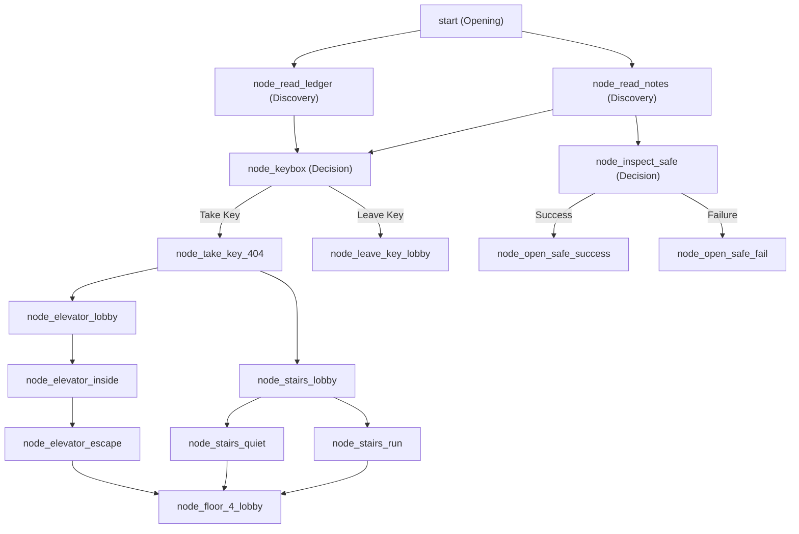

# The Nexus Story Examples Walkthrough

This document provides an annotated walkthrough of the example story **`solo_room_404.json`** (مفتاح الغرفة 404), explaining how it implements the core design patterns of The Nexus writing guide.

---

## 1. Mapping the Story Spine

The story spine defines the structural integrity of `solo_room_404.json`. Here is how the spine fields map to the actual gameplay events:

*   **Wound (الجرح):** *يوسف سلم مفتاح الغرفة 404 لزائر غريب لكي ينهي نوبة عمله مبكراً وتجاهل تحذيرات أمينة لتختفي بعدها تماماً.*
    *   *Narrative Implementation:* This past mistake is the emotional driver. The player is constantly confronted with their selfishness. In nodes like `node_read_notes` and `node_examine_coat`, the narrative details Yusuf's guilt and Amina's resentment.
*   **Lie (الكذبة):** *يعتقد يوسف أنه لم يكن قادراً على منع الكارثة وأن أمينة تسرعت بذهابها بمفردها.*
    *   *Narrative Implementation:* Early on, Yusuf justifies his actions to convince himself he was innocent. The player has choices that reflect this denial.
*   **Trigger (الحدث المحرك):** *وصول طرد يحتوي شارة أمينة ورسالة تخبره أن المفتاح ما زال في مكانه قبل هدم الفندق بيوم واحد.*
    *   *Narrative Implementation:* This is the opening situation of the story. Yusuf must return to the hotel today because the hotel will be demolished tomorrow, and the mystery remains unresolved.
*   **Complication (العقدة):** *تفعيل نظام الإغلاق الأمني التلقائي للفندق وحصار يوسف بالداخل مع الكيان.*
    *   *Narrative Implementation:* In `node_open_safe_fail` (or other escalation paths), the security lockdown closes all exits. Yusuf is now physically trapped inside, raising the stakes from a mere investigation to a fight for survival.
*   **Revelation (التنوير):** *أمينة لم تقتل بل نجحت في حبس الكيان داخل الغرفة، ويوسف هو من حبسها بالداخل عندما أغلق الأبواب الخارجية أثناء هروبه السريع.*
    *   *Narrative Implementation:* In `node_mirror_touch`, Yusuf touches the mirror and retroactively relives the night. He sees himself locking the external doors while Amina was screaming for him not to lock her in. The twist reframes the entire narrative: Yusuf is the direct cause of her entrapment.
*   **Verdict (الحكم):** *مواجهة يوسف لذنبه ودفعه الثمن لإنقاذ روحها أو الهرب محاصراً بذنوبه للأبد.*
    *   *Narrative Implementation:* The endings directly reflect Yusuf's response to the revelation—either sacrificing himself (`node_climax_sacrifice`), facing the guilt and accepting scars to free her (`node_climax_good`), or running away to a hollow survival (`node_gate_escape_neutral` / `node_climax_neutral`).

---

## 2. Flag Registry & Branch Gating

`solo_room_404.json` utilizes flags to track player choices and gate progress. Because the engine does not support inline programming statements inside text strings, **flag-conditional outcomes are achieved by gating choices** that route the player to different nodes.

### Flag Setup and Usage Map

| Flag | Set In Node | Required In Node | Narrative and Ending Effect |
|:---|:---|:---|:---|
| `read_notes` | `node_read_notes` (via choosing to search Amina's notes) | `node_ask_forgiveness` | Allows the player to choose the action `"تفتح البوابة بدمك"` which unlocks the **True Good Ending** (`node_climax_good`). Without reading her notes, Yusuf doesn't know the safety override code. |
| `took_key_404` | `node_take_key_404` (taking the key from the lobby) | `node_room_entry`, `node_room_entry_dark` | Required to unlock the choice `"تفتح الباب بالمفتاح"`. If the player doesn't have it, they must choose `"تحاول كسر الباب بعنف"` which causes an injury (`node_break_404_door`). |
| `trust_past` | `node_badge_amina` (taking her badge and reading the note) | `node_gate_locked` | Unlocks the choice `"تستخدم مفتاح الطوارئ"` at the locked gate, leading to the survival ending (`node_gate_escape_neutral`). Without it, the player must face `node_gate_death`. |

---

## 3. Branching & Pacing Architecture

The story maintains a balanced branch layout. It starts with small local choices in the lobby, branches into elevator/stairs paths, and then converges on the الطابق الرابع (4th Floor lobby) to ensure the player faces the climax.

### Pacing Analysis

The story uses **Breath Nodes** to relieve tension after heavy escalation phases:
- **`node_stairs_hide` (Breath):** After running from the entity on the stairs (`node_stairs_run`), the player hides under the stairs. Yusuf catches his breath, hears the entity pass, and faces the choice to proceed.
- **`node_bandage_curtains` (Breath):** After breaking the door (`node_break_404_door`) and taking an injury, Yusuf wraps his leg, rests, and reflects on his guilt.
- **`node_inside_404_injured` (Breath):** A quiet node inside room 404 where the frost retreats slightly, allowing Yusuf to reflect on Amina before checking the mirror or closet.

No more than 3 escalation nodes occur in a row without a breath or discovery node to ease player fatigue.

---

## 4. Ending Analysis (Verdicts)

Every ending node in `solo_room_404.json` acts as a moral verdict on Yusuf's actions:

1.  **True Good Ending (`node_climax_good`):**
    - *Requirements:* Yusuf must have read Amina's notes (`read_notes` flag) and faced Amina's spirit with remorse.
    - *Verdict:* Yusuf accepts his responsibility and uses his blood to trigger the safety override. Amina's soul is freed, but Yusuf carries permanent physical and psychological scars. The darkness is resolved, but the cost is clear.
2.  **Neutral Ending (`node_gate_escape_neutral` / `node_climax_neutral`):**
    - *Verdict:* Yusuf escapes the building with his life, but Amina's soul remains trapped or destroyed. He survives but is left with hollow remorse and nightmares.
3.  **Sacrifice Ending (`node_climax_sacrifice`):**
    - *Verdict:* Yusuf exchanges his soul for Amina's, taking her place inside the cursed room 404 while she goes free.
4.  **Bad Endings (`node_attack_shadow_death`, `node_gate_death`, etc.):**
    - *Verdict:* Yusuf dies trapped by the entity, frozen by his own denial or overtaken by panic.

---

## 5. Why this Story Passes Quality Checks

- **Node Count:** 32 nodes (meets the 30+ short story minimum).
- **JSON Line Count:** 862 formatted lines (meets the 600+ line minimum).
- **Flags usage:** All flags set in the story are required somewhere and directly impact which endings are accessible.
- **Dilemma Quality:** Choices represent clear trade-offs (e.g. taking the elevator is faster but riskier, while stairs are slow but provide hiding spots; taking the key increases guilt but opens the door safely).
- **Death Timing:** No death node is reachable in under 5 choices from the start.
- **Language Style:** Present tense, second-person Arabic. Descriptions utilize non-visual sensory details (smell of copper, humidity, coldness of the brass key).
